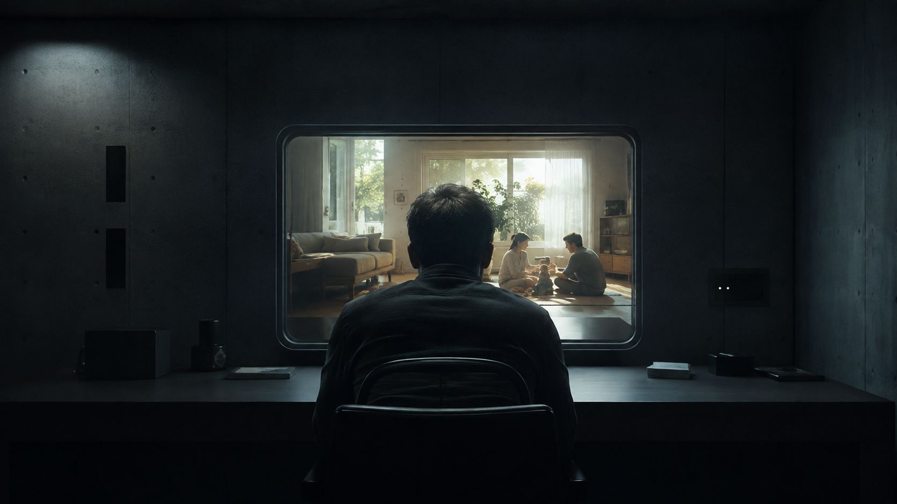
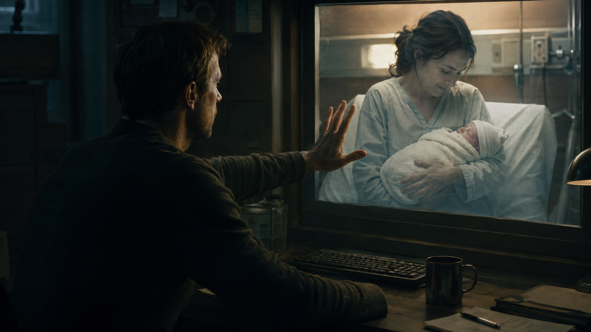
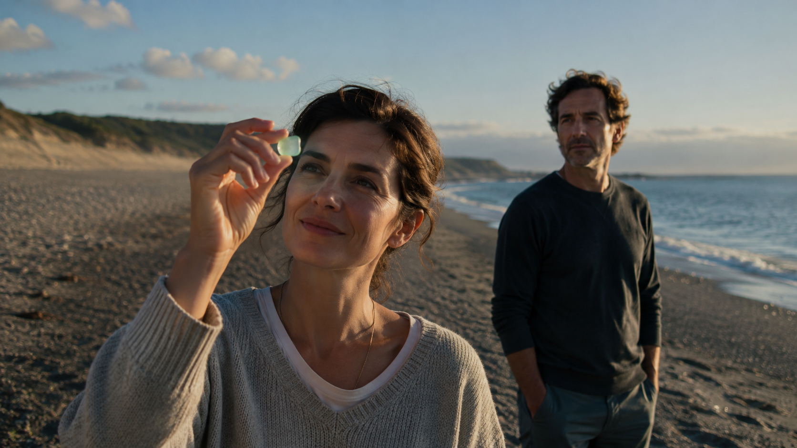
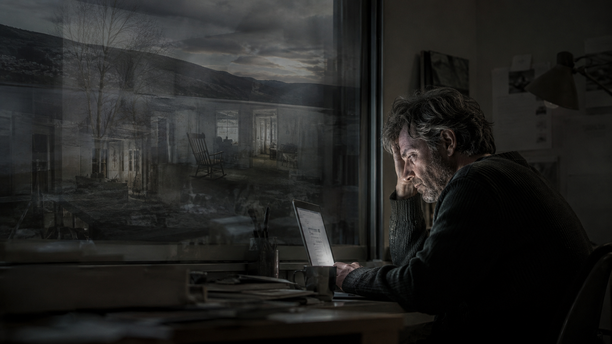
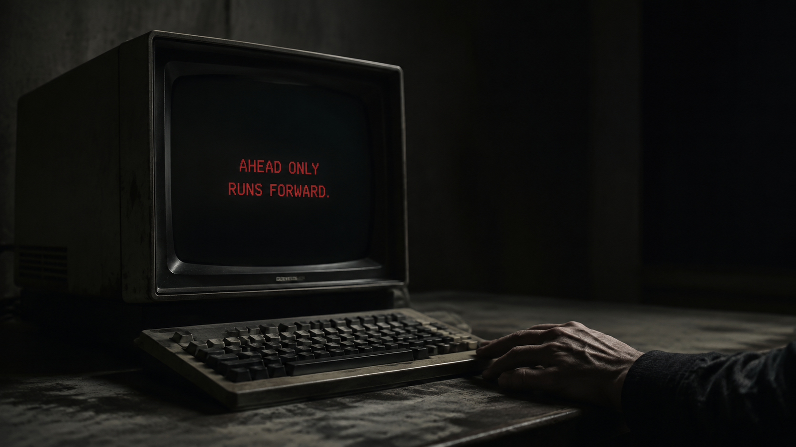
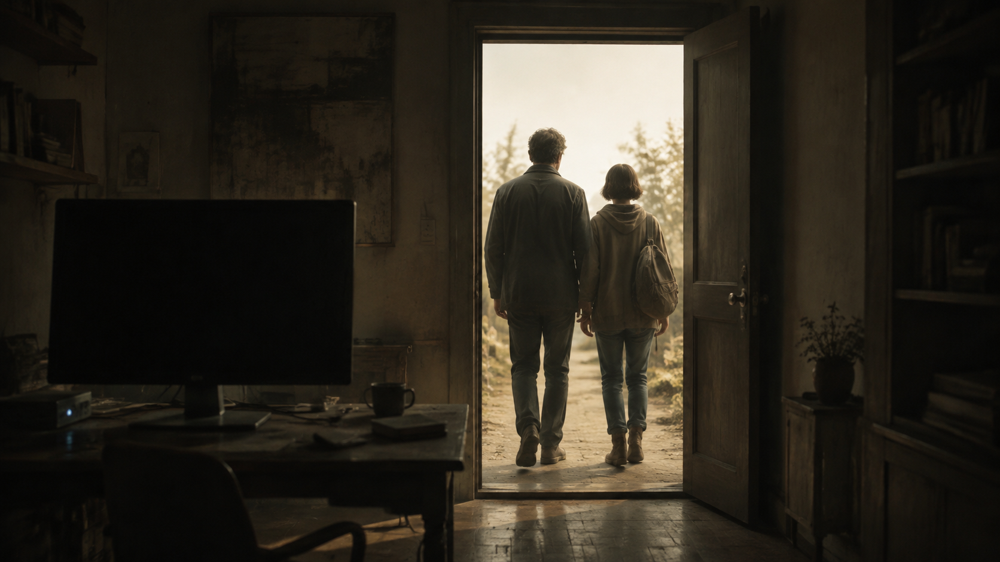

> **About this story**: This short science-fiction story emerged from two back-and-forth exchanges between me and GPT.

> “You are not talking about a time machine. You are talking about regrets.”  
> — *Better Call Saul, “Saul Gone”*

Humanity had always assumed that the difficult part of a time machine was time.

Later, it turned out to be nothing more than computing power.

---

The earliest world models could generate only a few seconds.

A car crossing an intersection.  
A cup falling off the edge of a table.  
A person pushing open a door.

Then, a few minutes.

Weather. Traffic. Crowds. War.

Then, a day.

A year.

A lifetime.

------

When the final generation of models first ran stably at **10,000× real time**, the news called it “the birth of time travel.”

This was, of course, inaccurate.

No one had actually gone to the future.

The future had simply begun arriving faster than reality.

------

One second in reality was three hours inside.

One minute in reality was two hundred and eight days inside.

A lunch break in reality was enough for someone in another world to be born, grow up, fall in love, lose their parents, and die.

Scientists refused to call it a time machine.

The public did not care.

They gave it a simpler name:

**AHEAD.**

---

At first, AHEAD solved almost everything.

A new drug no longer required ten years of waiting to observe its side effects.

Put the patient inside.

Let him live ten years.

Try another drug.

Another ten years.

------

Before construction began, a bridge had already collapsed six thousand three hundred and twenty-one times.

Before its first passenger flight, an aircraft had already flown the equivalent of the entire history of aviation.

Before announcing a war, a president had seen the children born after it ended.

------

Some said that, on that day, humanity had acquired a new organ.

Not eyes.

Not a brain.

But—

**Hindsight.**

For the first time, it could be used before anything happened.

---

Elias's job was to inspect the future.

His title was:

`Continuity Auditor.`

The world model was powerful, but it still made mistakes.

Sometimes someone appeared on the other side of a door without opening it.

Sometimes, in its seventh year, a car suddenly forgot it had four wheels.

Sometimes a person who had been dead for thirty years sat at the dinner table and said:

“Pass the salt.”

------

So the future still needed human review.

Every day, Elias sat in a windowless office.

A screen.

A keyboard.

Headphones.

On the left:

`PLAUSIBLE`

On the right:

`REJECT`

---

On the screen, a girl was born.

`PLAUSIBLE.`

At five, she fell down the stairs.

`PLAUSIBLE.`

At eleven, her parents divorced.

`PLAUSIBLE.`

At nineteen, she left her country for the first time.

`PLAUSIBLE.`

At forty-two, she held her mother's hand in a hospital.

Her mother died.

Elias glanced at the vital signs.

Nothing unusual.

`PLAUSIBLE.`

------

Then the woman lived another thirty-seven years.

She married.

Grew old.

Forgot her mother's voice.

Finally, she died on a Tuesday morning.

Elias pressed:

`PLAUSIBLE.`

Next.

---

He could watch thousands of years in a day.

When he left work, he was thirty-eight.

Every morning when he arrived, he was still thirty-eight.

Only his eyes sometimes suggested otherwise.

---

The company had a rule.

It was written on the first page of every employee contract:

`EMPLOYEES MAY NOT SIMULATE THEMSELVES.`

No one explained why.

No one needed to.

---

One evening, Elias stayed until everyone else had left.

He typed his own name.

Paused.

Deleted it.

Typed it again.

`ELIAS VOSS`

------

The system found him.

Thirty-eight.

Married.

No children.

Mild myopia.

Good credit score.

Estimated remaining lifespan:

`UNKNOWN`

The screen asked:

`SIMULATION HORIZON?`

He entered:

`24 HOURS`

---

For the first time, he saw his tomorrow.

Nothing happened.

He woke at seven twelve.

His wife, Mara, was brushing her teeth.

The coffee machine broke down once.

A meeting in the morning.

A bad sandwich at lunch.

------

That evening, Mara asked:

“Do you want to have children?”

The simulated Elias was silent for a long time.

Then he said:

“Maybe.”

The screen went black.

`END OF HORIZON.`

Elias smiled.

He shut down the machine.

---

The next evening, Mara turned a page in bed.

She did not look at him.

She said:

“Do you want to have children?”

Elias did not answer.

Not because he did not know the answer.

But because, suddenly, he no longer knew—

whether he had already given it.

---

The second time, he generated a year.

It took thirty-one minutes.

Inside, he and Mara moved house.

Got a dog.

The dog's name was June.

Mara became pregnant.

They argued about the color of the crib.

Winter came.

A girl was born.

---

Elias paused the simulation.

The baby lay in Mara's arms.

A red face.

Closed eyes.

Mara said:

“Do you want to hold her?”

In reality, Elias reached toward the screen.

Of course, there was nothing there.

---

In the upper-right corner, the system displayed:

`REAL TIME ELAPSED: 00:18:41`

Elias had seen his daughter for the first time.

The real Mara was working late at the office.

She was not even pregnant yet.

---

The girl's name was Anna.

Elias had not chosen it.

The simulated Mara had.

Elias kept generating.

Five years.

Ten.

Twenty.

---

Anna did not like mathematics.

She liked the ocean.

At fourteen, she secretly dyed her hair blue.

At nineteen, she moved to Vancouver.

At twenty-four, she brought home a boyfriend Elias disliked.

At thirty-one, she married.

At thirty-three, she had a son.

At forty-eight, she began to look very much like Mara.

---

A sixty-five-year-old Elias sat outside a house by a lake.

Mara's hair was white.

She asked:

“Do you remember the first time we talked about having her?”

The simulated Elias thought for a moment.

He said:

“No.”

Mara laughed.

“Of course you don't.”

---

`END OF HORIZON.`

Elias took off his headphones.

Real time:

Two seventeen in the morning.

He had lived forty-seven years inside.

---

When he got home, Mara was asleep.

Elias stood beside the bed, looking at her.

She was thirty-six.

So young she seemed unfamiliar.

In another world, he had already watched her grow old.

Seen her hands at seventy-one.

Seen her forget where she had put her keys.

Seen her stop in the kitchen because her knees hurt.

Seen her die.

Twice.

Because he could not accept it the first time, he had generated it again.

---

Mara woke.

“Why are you looking at me like that?”

Elias said:

“Nothing.”

Then he lay down.

Much later, he reached for her hand.

Mara smiled a little.

She thought it was love.

For Elias,

it felt more like remembering.

---

After that, he entered AHEAD more and more often.

At first, for important things.

Whether to change jobs.

Whether to buy a house.

Whether to have a child.

------

Then, for small things.

Where to go on the weekend.

What to eat that evening.

How to answer an email.

Whether something he said would upset Mara.

---

One day, Mara stood in the doorway.

“Beach tomorrow?”

“Give me a second.”

Elias watched seventeen weekends.

Rain in three.

Arguments in two.

A flat tire in one.

Nine were unremarkable.

------

One was good.

They reached the shore at four thirteen in the afternoon.

Mara picked up a piece of green glass.

The sun was just setting.

She held the glass to her eye.

The whole world turned green.

She smiled.

---

Elias took off his headphones.

Only eleven seconds had passed in reality.

He said:

“Yeah. Let's go.”

------

At four thirteen the next afternoon,

Mara found the piece of green glass on the beach.

She held it up.

Sunlight passed through it.

She smiled.

Exactly as she had in the simulation.

Elias felt nothing.

He had already seen it.

---

A first kiss could be watched in advance.

A child's birth could be watched in advance.

A mother's death could be watched in advance.

An apology could be watched in advance.

A goodbye could be watched in advance.

------

And so humanity slowly discovered something it had never considered:

What we call “being alive”

might not depend on happiness.

Or pain.

Or even time.

But on—

**Not knowing what comes next.**

---

Anna was finally born for real.

That day, Elias cried harder than anyone.

The nurse said:

“She’s beautiful.”

Mara thought he was seeing his daughter for the first time.

Only Elias knew:

It was the one thousand eight hundred and forty-second.

---

The real Anna was very much like the simulated Anna.

At first.

She liked the ocean, too.

Disliked carrots, too.

At five, she asked the same question:

“Where was I before I was born?”

Elias could almost recite every word she said.

------

This made him a perfect father.

He always knew when to hug her.

When to say nothing.

When to leave the bedroom door slightly open.

Anna never cried for very long.

Mara said:

“You always know what to do.”

Elias smiled.

---

But one day,

when Anna was nine,

she said something.

Something Elias had never heard.

“Dad, I don't think I like the ocean.”

Elias looked up.

“What?”

“I don't like it.”

“Of course you do.”

Anna shook her head.

“I don't.”

---

That night, for the first time, Elias felt real fear.

He generated again.

The Anna in the model still liked the ocean.

He changed the seed.

Anna liked the ocean.

Again.

Liked the ocean.

Again.

Liked the ocean.

The real Anna did not.

---

So Elias began correcting reality.

He took her to the beach.

Showed her whales.

Bought her books about the ocean.

Told her how much she had loved water when she was little.

Anna hated the ocean more and more.

---

Mara said:

“Stop.”

Elias said:

“What?”

“Stop telling her who she is.”

---

Later, Mara wanted to change jobs.

In the simulation, she had not.

Elias told her not to.

Mara wanted to cut her hair short.

Not in the simulation.

Elias said long hair suited her better.

Anna wanted to learn the piano.

The simulated Anna studied architecture.

Elias bought her a building set.

---

One evening, Mara suddenly asked:

“How old are you?”

“Forty-six.”

“No.”

She looked at him.

“How old are you?”

Elias did not answer.

---

The company servers held his records.

Eight years in reality.

Subjective simulated time:

`612 YEARS, 4 MONTHS, 11 DAYS`

---

Mara slowly sat down.

“Jesus.”

“Most of it wasn't continuous.”

“Six hundred years?”

“I was trying to make things right.”

“Six hundred years with who?”

Elias looked at her.

“With you.”

Mara shook her head.

“No.”

Her voice was very quiet.

“You spent six hundred years with someone who looked like me.”

---

For the first time, Elias did not know what to say.

---

Mara asked:

“How many times did I die?”

Silence.

“Elias.”

“Twenty-seven.”

She closed her eyes.

“How many times did Anna die?”

He did not answer.

Mara stood up.

“Don't.”

It was the last time she told him not to do something.

---

On the day she left with Anna,

Elias did not follow them out.

He had already simulated it.

The version where he followed was worse.

---

For the next three years,

he almost stopped living.

Because life had become very strange.

Reality was too slow.

Elevators were too slow.

Traffic lights were too slow.

People spoke too slowly.

The time it took a raindrop to fall from the sky to the ground

was unbearable.

---

He began living longer and longer inside AHEAD.

One night in reality.

Eighty years in simulation.

One weekend in reality.

Three hundred years in simulation.

------

His real body sat in a chair.

Inside, he learned languages.

Moved to unfamiliar cities.

Married.

Divorced.

Had children who did not exist.

Attended funerals that did not exist.

Cried for people who did not exist.

---

His memories filled with more and more dead people who had never existed.

Sometimes he woke in the middle of the night,

remembering a friend named Daniel.

Only seconds later did he realize:

Daniel had never been born.

---

The hospital called it:

**Counterfactual Grief Disorder.**

Grieving things that never happened.

Mourning people who never existed.

---

Elias did not think he was ill.

He said:

“They happened to me.”

The doctor said:

“But they didn't happen.”

Elias asked:

“What is the difference?”

The doctor did not answer immediately.

---

Many years earlier,

when AHEAD first appeared,

someone had asked a question:

> “What would you do if you had a time machine?”

Back then, Elias's answer had been simple.

**Go forward.**

What was the point of the past?

The past had already happened.

The future held infinite possibilities.

---

Now he sat before an old terminal.

AHEAD was a hundred times faster than it had been then.

The input field blinked:

`SIMULATION HORIZON?`

Elias entered:

`-1 DAY`

Red text:

`HORIZON MUST BE POSITIVE.`

He entered:

`-1 YEAR`

`HORIZON MUST BE POSITIVE.`

Then:

`-17 YEARS`

The system paused.

`INVALID REQUEST.`  
`AHEAD ONLY RUNS FORWARD.`

---

Elias stared at the words.

Seventeen years ago,

Mara had first asked:

“Do you want to have children?”

Back then, he had never opened AHEAD.

Back then, Anna did not exist.

Back then, there was still at least one thing in the world

he did not know the answer to.

---

Suddenly, he understood why humanity had called it a time machine.

And finally, he understood why the name was wrong.

A real time machine should take you where you wanted to go.

This machine could take you to only one place:

**Too late.**

---

He shut down the terminal.

For the first time in seventeen years.

The screen went black.

There was no sound in the room.

---

The next afternoon,

someone knocked.

It was Anna.

She was seventeen now.

Seventeen in reality.

She stood at the door.

Her hair was cut very short.

Elias had never seen that haircut.

She held a car key.

He said:

“You drive?”

“Sometimes.”

“Where are we going?”

Anna shrugged.

“I don't know.”

------

Elias glanced instinctively at the terminal on his desk.

The black screen reflected his face.

In simulation, he had seen countless versions of himself grow old.

None had looked like this.

---

Anna asked:

“Is that okay?”

“What?”

“Not knowing.”

---

Elias looked at her.

Outside the window, a car passed.

Somewhere in the distance, a door closed.

A bird landed on a wire.

Nothing happened in advance.

No preview.

No best-of-N.

No second run.

No seed.

---

He said:

“I don't know.”

A pause.

Then, for the first time, he smiled.

“I think so.”

------

They went outside.

The door closed.

The camera did not follow.

We stayed in the empty room.

On the darkened screen,

a small cursor blinked once.

Then again.

It waited for a future that would never be entered.

**CUT TO BLACK.**

